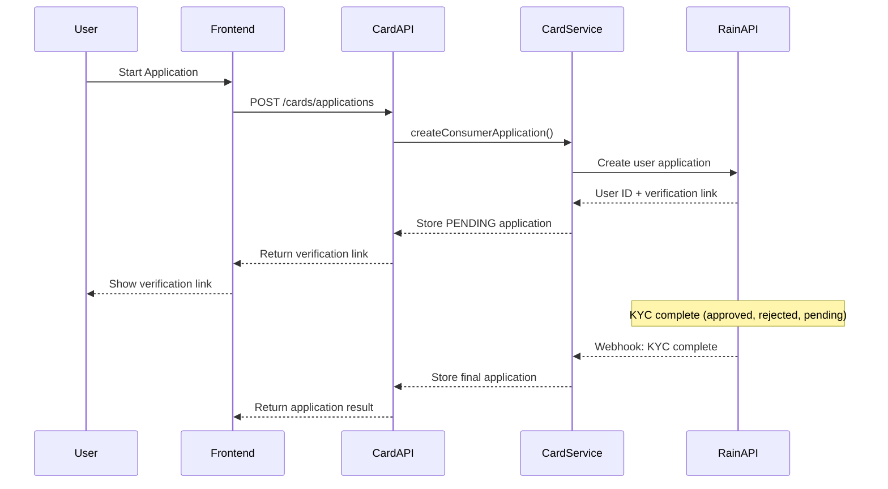
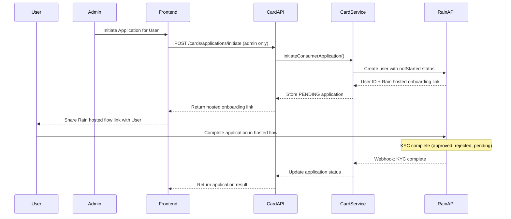
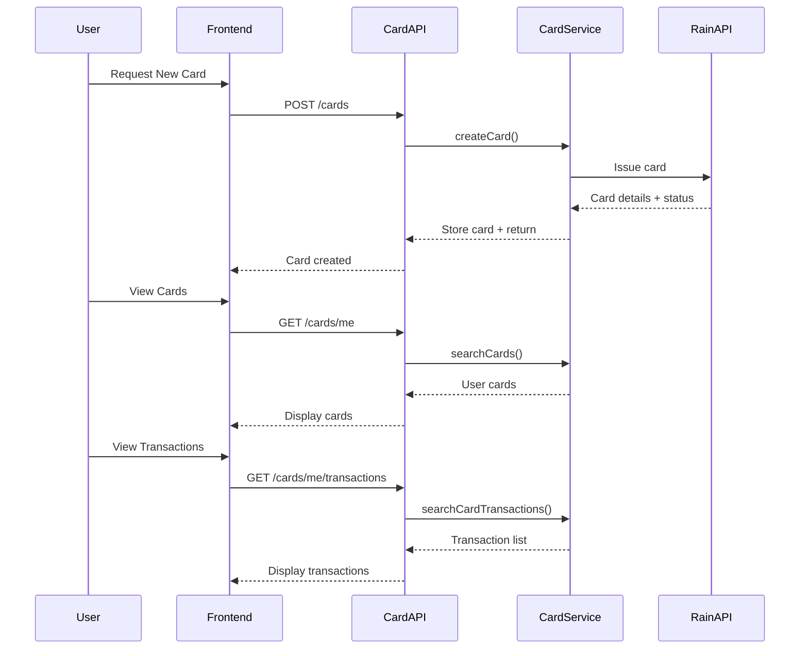
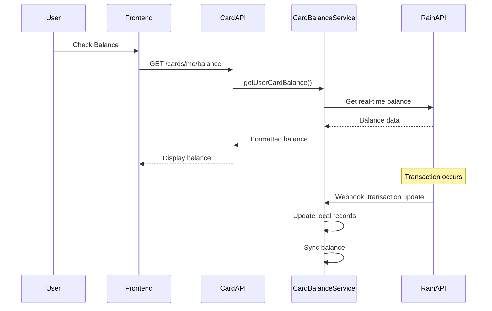

# Card Architecture & Integration Guide

## Table of Contents

1. [High-Level Architecture](#high-level-architecture)
2. [Core Components](#core-components)
3. [User Flows](#user-flows)
4. [Integration Guide](#integration-guide)
5. [API Overview](#api-overview)
6. [Data Models](#data-models)
7. [Security & Compliance](#security--compliance)

## High-Level Architecture

### Overview

The Card Module is a comprehensive virtual and physical card management system that integrates with third-party card providers (currently Rain) to offer card issuance, lifecycle management, and transaction processing capabilities.

### System Architecture Diagram

```
┌─────────────────┐    ┌─────────────────┐    ┌─────────────────┐
│   Frontend UI   │    │   Card Module   │    │  Card Provider  │
│                 │◄──►│                 │◄──►│     (Rain)      │
│ - Web App       │    │ - Controllers   │    │                 │
│ - Mobile App    │    │ - Services      │    │ - User Mgmt     │
│                 │    │ - Repositories  │    │ - Card Issuance │
└─────────────────┘    │ - Validations   │    │ - Transactions  │
                       └─────────────────┘    └─────────────────┘
                                │
                       ┌─────────────────┐
                       │   Database      │
                       │                 │
                       │ - Accounts      │
                       │ - Card Apps     │
                       │ - Cards         │
                       │ - Transactions  │
                       │ - Balances      │
                       └─────────────────┘
```

### Key Design Principles

- **Provider Abstraction**: Clean separation between our system and card providers
- **One Account = One Provider User**: Each account can only have one user registration with the card provider
- **KYC-First Approach**: Cards can only be issued after successful KYC verification
- **Real-time Sync**: Continuous synchronization with provider APIs for data consistency
- **Multi-Tenant Support**: Designed to serve multiple businesses with proper isolation

## Core Components

### 1. Card Application (User Registration)

**Purpose**: Represents the merchant's registration with the card provider

**Key Features**:

- One-to-one relationship with Accounts (merchants)
- Handles KYC verification process
- Stores provider user ID and verification links
- Contains user data and application status

**Entity**: `CardApplication`

```typescript
interface CardApplication {
	id: string;
	accountId: string; // Our Account ID
	role: CardApplicationRole; // USER, COMPANY, UOB
	userProviderId: string; // Provider's user ID
	userData: object; // User information
	applicationStatus: string; // PENDING, APPROVED, DENIED, etc.
	verificationLink?: string; // KYC verification URL
	completionLink?: string; // Application completion URL
}
```

### 2. Cards

**Purpose**: Individual virtual or physical cards issued under an application

**Key Features**:

- Multiple cards per application
- Different types (virtual, physical)
- Individual limits and security settings
- Linked to provider's external card ID

**Entity**: `Card`

```typescript
interface Card {
	id: string;
	accountId: string;
	cardApplicationId: string;
	cardProvider: CardProvider;
	cardProviderId: string; // Provider's card ID
	type: CardType; // VIRTUAL, PHYSICAL
	status: CardStatus; // ACTIVE, LOCKED, CANCELLED, etc.
	last4: string; // Last 4 digits
	expirationMonth: number;
	expirationYear: number;
	limitAmount?: number;
	limitFrequency?: string;
}
```

### 3. Card Balance

**Purpose**: Real-time balance information for each card application

**Key Features**:

- Synced with provider API
- Credit limits and spending power
- Pending and posted charges

**Entity**: `CardBalance`

```typescript
interface CardBalance {
	id: string;
	accountId: string;
	cardApplicationId: string;
	creditLimit: number;
	pendingCharges: number;
	postedCharges: number;
	balanceDue: number;
	spendingPower: number;
}
```

### 4. Card Transactions

**Purpose**: Transaction history and details

**Key Features**:

- Synced from provider transaction data
- Merchant details and categorization
- Dispute management integration

**Entity**: `CardTransaction`

```typescript
interface CardTransaction {
	id: string;
	cardId: string;
	accountId: string;
	transactionProviderId: string;
	amount: string;
	currency: string;
	status: string;
	transactionDate: Date;
	merchantName: string;
	merchantCategory: string;
	// ... additional fields
}
```

### 5. Service Layer Architecture

#### CardService

**Responsibilities**:

- Card lifecycle management (create, update, delete)
- Card operations (freeze, unfreeze, set limits)
- Transaction retrieval and management
- Dispute handling

#### CardApplicationService

**Responsibilities**:

- User registration with providers
- KYC document management
- Application status tracking
- Agreement handling

#### CardProviderService

**Responsibilities**:

- Provider abstraction layer
- API integration with card providers
- Request/response transformation
- Error handling and retry logic

#### CardBalanceService

**Responsibilities**:

- Balance synchronization
- Spending power calculations
- Transaction processing
- Deposit/withdrawal management

## User Flows

### 1. Consumer Card Application Flow



### Alternative Flow: Admin-Initiated Application



**Detailed Steps**:

1. **Application Creation** (`POST /cards/applications`):
   - User provides complete application data including KYC information
   - System creates user application with provider
   - Provider returns user ID and verification link
   - User receives verification link to complete KYC process
   - **This is the standard flow for most consumer applications**

2. **KYC Completion**:
   - User completes KYC verification via provider's hosted flow
   - Provider processes application (approved, rejected, or pending)
   - System receives webhook updates about application status
   - Final application status is stored in local database

3. **Optional Admin Initiation** (`POST /cards/applications/initiate` - Admin Only):
   - Admin can initiate application with minimal data
   - Creates user with `notStarted` status
   - User receives provider's hosted onboarding link
   - **Alternative flow for businesses wanting to redirect users to provider's hosted flow**

4. **Card Issuance** (after approval):
   - User can now create cards via `POST /cards`
   - Multiple cards can be issued under one application

### 2. Card Management Flow



### 3. Balance & Transaction Flow



## Integration Guide

### For New Businesses Wanting to Use Card Service

#### 1. Account Setup Requirements

**Prerequisites**:

- Valid business account in the system
- KYC verification completed for the business
- Agreement with card provider terms

**Setup Process**:

1. Create account in your system
2. Initiate card application via API
3. Complete KYC verification process
4. Wait for approval from card provider
5. Start issuing cards

#### 2. API Integration Steps

**Step 1: Authentication**

```typescript
// Use your existing authentication system
const headers = {
	Authorization: 'Bearer YOUR_JWT_TOKEN',
	'Content-Type': 'application/json',
};
```

**Step 2: Create Card Application**

```typescript
// Consumer Application - Complete application with all data
const applicationResponse = await fetch('/cards/applications', {
	method: 'POST',
	headers,
	body: JSON.stringify({
		firstName: 'John',
		lastName: 'Doe',
		email: 'john@example.com',
		address: {
			line1: '123 Main St',
			city: 'New York',
			region: 'NY',
			postalCode: '10001',
			countryCode: 'US',
		},
		birthDate: '1990-01-01',
		nationalId: '123456789',
		countryOfIssue: 'US',
		acceptESignConsent: true,
		acceptCardTermsAndPrivacy: true,
		certifyInformationAccuracy: true,
		acknowledgeNotSolicitation: true,
	}),
});
```

**Step 3 (Optional): Admin-Initiated Application**

```typescript
// Admin can initiate application with minimal data
const initiateResponse = await fetch('/cards/applications/initiate', {
	method: 'POST',
	headers,
	body: JSON.stringify({
		firstName: 'John',
		lastName: 'Doe',
		email: 'john@example.com',
		accountId: 'user-account-id',
	}),
});
// Returns verification link for user to complete application
```

**Step 4: Issue Cards**

```typescript
// After application approval
const cardResponse = await fetch('/cards', {
	method: 'POST',
	headers,
	body: JSON.stringify({
		type: 'VIRTUAL',
		provider: 'RAIN',
		limit: {
			amount: 1000,
			frequency: 'per24HourPeriod',
		},
		displayName: 'Company Card',
	}),
});
```

#### 3. Webhook Integration

**Required Webhooks**:

- Card status updates
- Transaction updates
- Balance changes
- KYC status changes

**Webhook Format**:

```typescript
interface CardWebhook {
	eventType: 'card.status.updated' | 'transaction.created' | 'balance.updated';
	data: {
		cardId?: string;
		transactionId?: string;
		accountId: string;
		status?: string;
		amount?: string;
		timestamp: string;
	};
}
```

#### 4. Testing Integration

**Sandbox Environment**:

1. Use test credentials provided by card provider
2. Test with sandbox API endpoints
3. Verify webhook delivery
4. Test card lifecycle scenarios

**Test Scenarios**:

- Application initiation and completion
- Card creation and activation
- Transaction processing
- Balance updates
- Card freezing/unfreezing
- Dispute creation

#### 5. Production Deployment

**Pre-launch Checklist**:

- [ ] All API endpoints tested
- [ ] Webhooks configured and tested
- [ ] Error handling implemented
- [ ] Monitoring and alerting set up
- [ ] Compliance requirements met
- [ ] Customer support processes documented

**Monitoring Requirements**:

- API response times
- Error rates
- Card transaction volumes
- Balance synchronization status
- Webhook delivery success rate

## API Overview

### Key Endpoints

#### Card Application Management

- `POST /cards/applications/initiate` - Initiate consumer application
- `POST /cards/applications` - Complete consumer application
- `GET /cards/applications/me` - Get user's applications
- `POST /cards/applications/:userId/upload-document` - Upload KYC documents

#### Card Management

- `POST /cards` - Create new card
- `GET /cards/me` - Get user's cards
- `GET /cards/:cardId` - Get card details
- `PUT /cards/:cardId` - Update card
- `DELETE /cards/:cardId` - Delete card

#### Transactions & Balance

- `GET /cards/me/transactions` - Get card transactions
- `GET /cards/transactions/:transactionId` - Get transaction details
- `GET /cards/me/balance` - Get card balance
- `GET /cards/me/deposits-withdrawals` - Get deposit/withdrawal history

#### Card Operations

- `GET /cards/:cardId/secrets` - Get card details (PAN, CVC)
- `PUT /cards/:cardId/pin` - Set card PIN
- `POST /cards/:cardId/report-lost` - Report lost card
- `POST /cards/transactions/:transactionId/disputes` - Create dispute

### Response Format

```typescript
interface APIResponse<T> {
	success: boolean;
	data?: T;
	message: string;
	error?: string;
}
```

### Error Handling

```typescript
interface ErrorResponse {
	success: false;
	message: string;
	error: string;
	statusCode: number;
}
```

## Data Models

### Account Relationship

```
Account (1) ─── (1) CardApplication (1) ─── (*) Card
                    │
                    └── (1) CardBalance
```

### Transaction Flow

```
Card (1) ─── (*) CardTransaction
       │
       └── (*) CardTransactionDispute
```

### Key Enums

```typescript
enum CardProvider {
	RAIN = 'RAIN',
}

enum CardType {
	VIRTUAL = 'VIRTUAL',
	PHYSICAL = 'PHYSICAL',
}

enum CardStatus {
	PENDING = 'PENDING',
	ACTIVE = 'ACTIVE',
	LOCKED = 'LOCKED',
	CANCELLED = 'CANCELLED',
	NOT_ACTIVATED = 'NOT_ACTIVATED',
	SUSPENDED = 'SUSPENDED',
}

enum CardApplicationRole {
	USER = 'USER',
	COMPANY = 'COMPANY',
	UOB = 'UOB', // Ultimate Beneficial Owner
}

enum ApplicationStatus {
	PENDING = 'PENDING',
	APPROVED = 'APPROVED',
	DENIED = 'DENIED',
	NEEDS_INFORMATION = 'NEEDS_INFORMATION',
	NEEDS_VERIFICATION = 'NEEDS_VERIFICATION',
	MANUAL_REVIEW = 'MANUAL_REVIEW',
}
```

## Security & Compliance

### Security Measures

1. **Encryption**: All sensitive data encrypted at rest and in transit
2. **Authentication**: JWT-based authentication with role-based access control
3. **Authorization**: Strict access controls based on account ownership
4. **Audit Logging**: Comprehensive audit trails for all card operations
5. **PCI Compliance**: Adherence to PCI DSS requirements for card data

### Compliance Features

1. **KYC Verification**: Integrated identity verification process
2. **AML Monitoring**: Transaction monitoring for suspicious activities
3. **Data Privacy**: GDPR and CCPA compliant data handling
4. **Regulatory Reporting**: Automated reporting to regulatory bodies
5. **Document Retention**: Secure document storage with retention policies

### Best Practices for Integration

1. **Secure API Keys**: Store provider API keys securely
2. **Rate Limiting**: Implement proper rate limiting
3. **Data Minimization**: Only collect necessary user data
4. **Regular Audits**: Conduct regular security audits
5. **Incident Response**: Have incident response procedures in place

---

## Next Steps

1. **Review Architecture**: Understand the system architecture and data flow
2. **Set Up Development Environment**: Get access to sandbox APIs
3. **Implement Basic Integration**: Start with application initiation
4. **Test End-to-End Flows**: Verify complete user journeys
5. **Deploy to Production**: Follow pre-launch checklist
6. **Monitor and Maintain**: Set up ongoing monitoring

For technical support or questions about integration, please refer to the API documentation or contact the development team.
